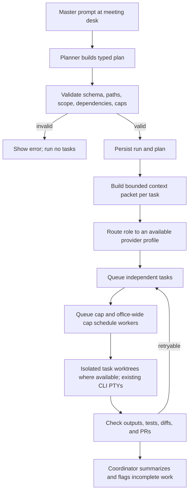

# Increasing Intelligence: Bionic GPT Research and Agent Office Roadmap

**Status:** Research and implementation plan only; no Bionic code or runtime has been added.
**Research snapshot:** 2026-10-02. Bionic GPT `main` at `5bf9424f3470503eae94ae0f66809cd9b372bf60`; Agentic-hub at `d02834c` plus the existing uncommitted Agent Office work in this checkout.

## Executive Summary

Use Bionic GPT as an architectural reference, not as a dependency or a replacement runtime. Bionic is a Rust application-owned chat harness: it builds context around configured model requests, exposes a mediated tool/sandbox environment, lazily supplies files and skills, supports dataset retrieval, and persists conversations, outputs, and usage with access controls. It does **not** provide a ready-made semantic multi-agent router for Agent Office to import.

Agent Office already has the more relevant execution foundation: provider-specific CLIs, worker PTYs, per-project floors and worktrees, a persistent task queue, an office-wide worker cap, editable prompts, accounts and per-user sign-ins, MCP tools, and a first Swarm meeting that writes and validates `plan.json`. The next intelligence work should build on those pieces in this order:

1. Harden the existing Swarm plan and isolate its generated artifacts.
2. Add typed task dependencies, role profiles, and explicit model/provider routing policies.
3. Build bounded, provenance-aware project context packets and reusable skills.
4. Add opt-in local repository retrieval first; consider embeddings only after measuring whether lexical/symbol search is insufficient.
5. Add fan-in verification, partial retry, durable outcomes, and evaluation before making intelligent routing the default.

## Research Findings

### Bionic GPT

Bionic was inspected at commit [`5bf9424`](https://github.com/bionic-gpt/bionic-gpt/commit/5bf9424f3470503eae94ae0f66809cd9b372bf60). Its relevant design is divided across `agent-harness`, `tool-runtime`, `sandbox`, `rag-engine`, and `db` crates.

| Bionic pattern | Evidence in Bionic | Implication for Agent Office |
| --- | --- | --- |
| Context is assembled by the application around each model request. | [`context_builder.rs`](https://github.com/bionic-gpt/bionic-gpt/blob/5bf9424f3470503eae94ae0f66809cd9b372bf60/crates/agent-harness/context_builder.rs), [`chat_request.rs`](https://github.com/bionic-gpt/bionic-gpt/blob/5bf9424f3470503eae94ae0f66809cd9b372bf60/crates/agent-harness/chat_request.rs) | Construct a deliberate, per-task brief instead of sending the entire repo or relying on one generic role prompt. Preserve file/source provenance and context limits. |
| Context includes system prompts, optional skills, authorized integrations, attachments, and recent history. | `execute_prompt` in `context_builder.rs`; `create_request` in `chat_request.rs` | Give each worker only the relevant project instructions, task details, issue/PR context, selected skills, and retrieved snippets. |
| History trimming preserves tool-call/result exchanges as units. | `group_tool_exchanges`, `generate_prompt` in `context_builder.rs` | Preserve complete plan/task/tool interactions when compacting Office run history; do not leave orphan tool results or tool calls. |
| Tool definitions are capability-gated. | `create_request` checks model capabilities before attaching tools in `chat_request.rs` | Router decisions must account for actual provider/agent capabilities, not just a label such as “frontend worker.” |
| Provider choice is attached to a configured model; it is not semantic multi-agent routing. | `model_host_by_chat_id`, model capability and provider fields in `chat_request.rs`; provider match in `ui_chat_orchestrator.rs` | Implement an Office-owned routing policy over available CLI providers. Do not claim Bionic already contains the desired task-to-specialist router. |
| Tools run through an application-controlled virtual filesystem and network boundary. | [`bashkit.rs`](https://github.com/bionic-gpt/bionic-gpt/blob/5bf9424f3470503eae94ae0f66809cd9b372bf60/crates/tool-runtime/builtin_tools/bashkit.rs), [`lazy_fs.rs`](https://github.com/bionic-gpt/bionic-gpt/blob/5bf9424f3470503eae94ae0f66809cd9b372bf60/crates/tool-runtime/lazy_fs.rs), [`contract.rs`](https://github.com/bionic-gpt/bionic-gpt/blob/5bf9424f3470503eae94ae0f66809cd9b372bf60/crates/sandbox/contract.rs) | Keep task execution behind Office’s established PTY/worktree/provider boundaries. Any new Office tools need explicit authorization, bounded execution, and account-aware credential handling. |
| Files can be listed without loading their content; content loads only when read. Writes are journaled and selected roots are read-only. | `LazyFilesystem` and `seeded_runtime` in `tool-runtime` | Prefer path manifests and selective file reads in context packets. Avoid copying large datasets or whole repositories into prompts. |
| Skills are discoverable from short summaries and read in full only when selected. | [`skills.rs`](https://github.com/bionic-gpt/bionic-gpt/blob/5bf9424f3470503eae94ae0f66809cd9b372bf60/crates/tool-runtime/skills.rs) | Add role/project skills as reusable instruction files with a compact index; include full skill text only for the chosen task. |
| RAG is a separate ingestion pipeline: extract, chunk, embed, store, then scope vector lookup to selected datasets. | [`rag-engine/main.rs`](https://github.com/bionic-gpt/bionic-gpt/blob/5bf9424f3470503eae94ae0f66809cd9b372bf60/crates/rag-engine/src/main.rs), [`vector_search.rs`](https://github.com/bionic-gpt/bionic-gpt/blob/5bf9424f3470503eae94ae0f66809cd9b372bf60/crates/db/vector_search.rs) | For code, begin with git-aware lexical/symbol retrieval. Embedding indexes should be optional and floor-scoped, not a mandatory new database/service. |
| Scheduled agent work is persisted, timezone-aware, and has a bounded model-turn loop. | [`scheduled_tasks.rs`](https://github.com/bionic-gpt/bionic-gpt/blob/5bf9424f3470503eae94ae0f66809cd9b372bf60/crates/tool-runtime/scheduled_tasks.rs), `run_scheduled_chat` in `ui_chat_orchestrator.rs` | Treat automation as a later extension of durable swarm runs, with explicit turn/retry/time/cost limits. |
| Identity, team scopes, model limits, and usage are enforced at the persistence/runtime boundary. | `db` migrations/queries, `authz.rs`, `agent-harness/limits.rs`, `result_sink.rs` | Every retrieved file, memory, sign-in, and worker action must stay within the existing floor/account ownership model. |

**Important limitation:** Bionic’s context token estimate in this revision is approximate (`serialized bytes / 4`), and history trimming is primarily recency-based. Reuse its separation of responsibilities and atomic history handling, but measure and improve the ranking/budget policy for Office rather than copying that estimator as “intelligence.”

### Agent Office Today

The following are existing local surfaces, including the current uncommitted Swarm work; this plan builds on them rather than replacing them:

- [`src/server/meetings.ts`](3d-office-of-agent-workers/src/server/meetings.ts) has the first Swarm pattern: one planner writes root `plan.json`; a bounded schema validator routes `agent-name` and `work` tasks into the queue; the meeting tracks task state and can cancel its group.
- [`src/server/queue.ts`](3d-office-of-agent-workers/src/server/queue.ts) persists task rows and enforces queue concurrency; swarm rows carry a group id and local cap. [`src/server/machine.ts`](3d-office-of-agent-workers/src/server/machine.ts) applies the separate office-wide limit across floors.
- [`src/server/workers.ts`](3d-office-of-agent-workers/src/server/workers.ts) launches actual provider CLIs in PTYs, validates provider/model options, applies account sign-ins, and assigns a working directory/worktree.
- [`src/server/agents.ts`](3d-office-of-agent-workers/src/server/agents.ts) and [`src/client/ui/provider.ts`](3d-office-of-agent-workers/src/client/ui/provider.ts) define available providers and validation. A meeting currently selects one provider/model/effort, so all tasks from one Swarm inherit that choice; `agent-name` currently labels a task, not a distinct runtime agent implementation.
- [`src/shared/prompts.ts`](3d-office-of-agent-workers/src/shared/prompts.ts) and the prompts settings UI already centralize editable issue, queue, meeting, board-agent, and office prompts.
- Project floors, worktrees, GitHub issues/PRs, worker usage, account ownership, and MCP/`office-workers` are already available. They should be the context, execution, and governance substrate.

**Current Swarm hardening issue to resolve first:** the planner currently writes `plan.json` into the project checkout without a meeting worktree, while specialist tasks later use queue worktrees. The plan file can dirty or collide with the shared checkout and is not necessarily present in each worker worktree. The durable plan should live under the meeting’s `.agent-office` state or an isolated swarm worktree; publish a project-visible copy only as an explicit artifact.

## Target Workflow



## Proposed Plan Contract

Evolve `plan.json` into a versioned, validated run manifest. Preserve the requested `agent-name` and `work` fields; all added fields are optional at first so existing generated plans remain usable.

```json
{
  "schemaVersion": 1,
  "title": "Improve account settings",
  "masterPrompt": "...",
  "tasks": [
    {
      "id": "frontend-settings",
      "agent-name": "frontend worker",
      "work": "You're a professional frontend designer and auditor for <project>. You're handed the following tasks: ...",
      "dependsOn": [],
      "acceptanceCriteria": ["..."],
      "context": { "include": ["src/client/", "docs/"], "exclude": ["dist/"] },
      "route": { "role": "frontend", "provider": "auto" }
    }
  ]
}
```

Validation should reject unknown schema versions, duplicate/unsafe IDs, empty or oversized work, invalid dependency references/cycles, excessive task counts or aggregate bytes, disallowed paths, and route ids that do not exist. The generated plan is data, never executable shell or a provider command. Keep the raw master prompt separate from normalized tasks and escape it as data when embedding it in a planner prompt.

## Roadmap

### Phase 0: Safety and Run Ownership

- Move plan input/output from the shared project root to a per-run state directory or the swarm worktree. Record the floor, source commit, initiator/account identity, selected provider/model, parallel cap, and timestamps.
- Only fan out code-editing tasks into isolated worktrees. For a non-Git floor, provide disposable per-task copies or refuse parallel code edits with a clear explanation; never let parallel workers mutate one shared checkout.
- Make a run state machine explicit: `planning`, `validating`, `queued`, `running`, `reviewing`, `completed`, `partial`, `failed`, `cancelled`.
- Make retries idempotent by stable run/task IDs. On restart, reconcile persisted swarm state with the persistent queue instead of duplicating tasks.
- Preserve current ownership checks: task workers run as the calling account, and a user must not retrieve another account’s private sign-ins, memory, or results.
- Keep the existing 12-task validation bound, queue concurrency, and machine-wide worker cap; add aggregate prompt, generated-plan, run-duration, and retry bounds.

**Exit gate:** malformed plans, duplicate submissions, existing project files, queue-full conditions, cancellation, and server restart cannot corrupt the checkout or create orphan workers/tasks.

### Phase 1: Typed Plans and Dependency-Aware Scheduling

- Add `schemaVersion`, stable `id`, `dependsOn`, and `acceptanceCriteria` to Swarm tasks; keep `agent-name` and `work` as the human-readable contract.
- Validate the whole graph before dispatch. Run only dependency-ready tasks; update successors only after prerequisites reach a successful state. A failed prerequisite should block or require an explicit override, not silently run downstream work.
- Keep queue FIFO behavior for unrelated work. Swarm groups should have fair scheduling and their own cap, while always yielding to the existing global office capacity guard.
- Expose group progress, blocked dependencies, retry state, and partial completion in the meeting and queue UI.
- Make stop/retry operate on one run id and preserve completed tasks and outputs.

**Exit gate:** deterministic tests cover DAG order, fan-out/fan-in, cycles, queue limit interactions, machine limit interactions, retry, stop, persistence, and reconciliation.

### Phase 2: Explicit Role and Provider Routing

- Introduce an allowlisted `AgentProfile`/role registry, separate from free-form `agent-name`. A profile describes supported task kinds, available provider/model choices, required sign-ins, safe defaults, and validation rules.
- Start with deterministic routing rules: explicit user selection wins; otherwise task role/capabilities select an eligible configured provider profile; otherwise use the meeting/default provider. Do not let generated JSON name arbitrary executables, set unrestricted CLI arguments, or access credentials.
- Capability-gate routes: a profile requiring code-editing, browser/network, image, or long-context support may only select a provider known to support it. Provider executable availability and per-account auth are checked before queueing.
- Persist the resolved route on each task. Show both the requested role and resolved provider/model in the meeting and queue.
- Add bounded fallback only for known pre-start failures (missing executable, unavailable auth, rejected model). Require explicit policy for fallback after a task has begun so a resumed task is not silently moved to a different provider.
- Record route reason and fallback events without storing API keys or raw secrets.

**Exit gate:** provider routing is deterministic, inspectable, permission-aware, testable with fake providers, and respects per-account sign-ins and existing provider validation.

### Phase 3: Context Manager and Reusable Skills

- Build an `AgentContext` service in the existing server layer. Inputs: master prompt, task plan, floor/project metadata, base commit/branch, issue/PR data, project instructions (`AGENTS.md`, `CLAUDE.md`, README), selected role skills, current git state, and retrieved files.
- Return a small context manifest with source paths, commit/version, relevance reason, and estimated size. Workers should inspect files in their own worktree; do not paste whole files/repositories into prompts by default.
- Allocate a configurable budget among invariant policy, project instructions, task/master prompt, acceptance criteria, task dependencies, issue/PR context, skills, retrieved excerpts, and previous run summaries. Preserve complete tool-call/result or task/result units when summarizing.
- Use compact indexes/manifests first and load full instructions or file contents on demand. Add freshness checks so stale summaries are not used after the base commit changes.
- Create project-scoped and role-scoped `SKILL.md` workflows using the existing prompt/skill patterns. Skills describe a task procedure and expected checks; they are not a source of authorization.
- Store durable project memory only as attributable, reviewable records (fact/decision, source path or PR, commit, date, owner, confidence). Start with explicit human-approved promotion from a completed run; never auto-promote unverified model claims.

**Exit gate:** tests show context respects size limits, references correct worktree paths, excludes secrets and unrelated floors, avoids stale retrieval, and can be disabled per run.

### Phase 4: Repository Retrieval and Optional RAG

- Begin with `git ls-files`, ripgrep, symbol search, imports/references, project instructions, changed files, and relevant issue/PR paths. Return ranked snippets with file path and line ranges rather than anonymous summaries.
- Cache indexes by floor and commit; invalidate incrementally from Git changes. Exclude `.git`, `.agent-office`, build outputs, secrets, generated dependencies, and ignored files by default.
- Measure retrieval quality, context tokens, time-to-first-worker, duplication, and stale-hit rate before introducing embeddings.
- If lexical/symbol retrieval is insufficient, add an opt-in embedding index with a pluggable local or self-hosted backend. Scope every query to the current floor and authorized account; persist index version/model/commit and provide deletion/rebuild controls.
- Do not make PostgreSQL, pgvector, Unstructured, Kreuzberg, Kubernetes, or Bionic's object-store stack prerequisites for the default Agent Office install.

**Exit gate:** retrieval beats the lexical baseline on a small repository task set and never crosses floor/account boundaries.

### Phase 5: Verification, Synthesis, and Durable Workflow

- After task completion, gather task status, worktree diff, tests/checks, branch/PR links, and declared acceptance results.
- Run an independent reviewer profile over the combined change; use the existing review-panel workflow where appropriate. A coordinator summarizes completed work, failed/blocked tasks, conflicts, skipped criteria, cost/usage, and next actions; it must not claim checks passed without evidence.
- Add optional bounded automatic retries for transient launch failures and explicit human review for conflicting edits or repeated test failures.
- Persist a run report and artifact manifest under office state. Export to a project file or PR only when the user requests it.
- Consider scheduled/repeating swarms only after one-shot run reconciliation, identity scoping, stop semantics, and resource limits are reliable.

**Exit gate:** every run yields an auditable final state and evidence-based report, including partial/failure cases; no worker or queued task remains after cancellation.

## Security, Reliability, and Product Constraints

- Do not port Bionic’s Rust `agent-harness`, database, Dioxus UI, or cluster stack into this Node/TypeScript/PTTY application. Reuse concepts and implement against Office-owned interfaces.
- Do not expose a generic web/API command execution endpoint. Existing provider CLIs, account isolation, worktrees, PTYs, machine capacity, and MCP boundaries remain the execution path.
- Treat planner output as untrusted input. Parse structured JSON, validate every field and path, cap sizes/counts, and never interpolate generated strings into shell command arguments.
- Keep generated plans and context out of the shared checkout by default. If users choose a committed plan/report, write it through an explicit artifact action.
- Scope retrieval, memory, and tool credentials by floor, account, and selected repositories. Secrets and raw auth material never enter prompts, logs, plans, memory, or browser state.
- Respect model-provider capabilities and authentication before scheduling. Tool support, context size, multimodal input, and model effort differ across installed agents.
- Preserve manual queue, direct hire, meeting, and provider-picker behavior. Intelligent routing is opt-in until evaluation demonstrates consistent improvement.

## Evaluation and Acceptance Criteria

Create a small repeatable benchmark of real repository tasks: one-worker baseline, manual meeting, current Swarm, routed Swarm, and routed Swarm with retrieval. Measure pass rate against tests/acceptance criteria, human rework, wall-clock time, duplicate/conflicting file edits, prompt/context size, model cost where available, failed launches, and cancellation cleanup.

The feature is ready for default use only when:

- Generated plans validate before any specialist is launched and persist across restart without duplicate execution.
- Dependencies, route decisions, worker limits, account ownership, and per-floor context are visible and deterministic.
- Each task runs in its own isolated worktree; parallel tasks cannot overwrite one shared checkout.
- The system distinguishes `done`, `failed`, `blocked`, and `cancelled`, and final reports cite checks/PRs rather than model assertions.
- Focused tests and the full repository gates pass; routing/retrieval changes include prompt-injection, cross-account, path-traversal, provider-unavailable, and stale-context tests.

## First Implementation Slice After This Plan

1. Harden current Swarm artifact isolation and persistence before adding more “intelligence.”
2. Version the plan schema and add dependency-aware task states while keeping old plans readable.
3. Add role profiles and deterministic provider routing with a visible explanation.
4. Add a context manifest for project instructions, task files, issue/PR references, and acceptance checks; initially use lexical/symbol retrieval only.
5. Add measurable evaluations; consider embeddings, durable memory, and scheduled workflows only when the simpler system shows a concrete gap.